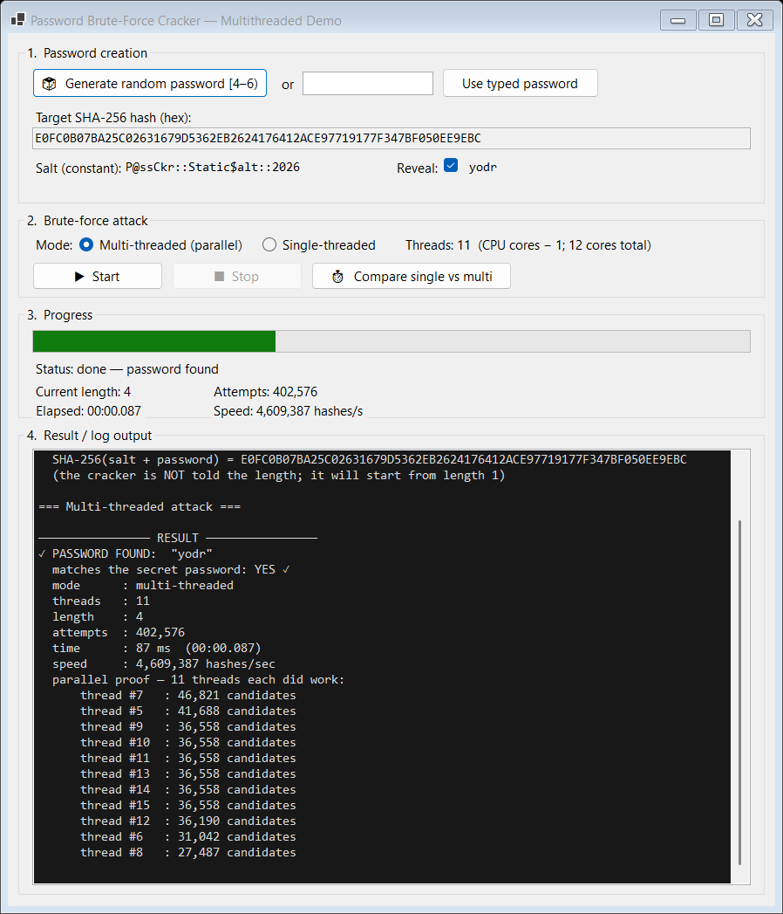
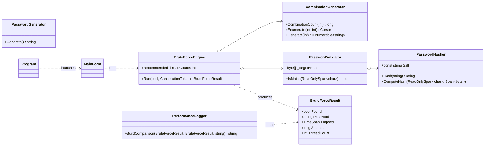

# Password Brute-Force Cracker (Multithreaded)

A Windows Forms (.NET 10, C#) desktop application that demonstrates a **multi-threaded brute-force
attack** against a password hashed with **SHA-256 + a constant static salt**. It generates a secret
password of random length, then cracks it by trying every combination from length 1 upward, using
**(CPU cores − 1)** worker threads in parallel, and logs the performance difference against a
single-threaded baseline.

> **Repository:** https://github.com/JOJOCUP1/password-bruteforce-cracker
>
> ⚠️ **Educational use only.** This project is a university assignment that illustrates why salting,
> slow hashing, and long passwords matter. SHA-256 is intentionally used here as the *target* to be
> brute-forced; it is **not** a recommendation for storing real passwords (use a slow KDF such as
> PBKDF2/bcrypt/Argon2 for that).



---

## ✨ Features (GUI)

* **Password creation** – generate a random password (length 4–5) or type your own test password.
* **Start / Stop** the brute-force attack at any time.
* **Progress indicator** – progress bar + current length, attempt counter and hash-rate.
* **Elapsed-time display** updated live while the attack runs.
* **Result output** – the found password, time taken, attempts, and a per-thread work breakdown
  that proves multiple threads ran simultaneously.
* **Compare single vs multi** – runs both modes and logs the performance difference to
  `performance_log.txt`.

---

## ✅ Requirement → implementation map

| # | Requirement | Where it lives |
|---|-------------|----------------|
| 1 | UML class diagram | [`docs/UML_ClassDiagram.png`](docs/UML_ClassDiagram.png) ([source](docs/UML_ClassDiagram.mmd)) |
| 2 | GUI: create / start-stop / progress / time / result | [`UI/MainForm.cs`](PasswordBruteForcer/UI/MainForm.cs) |
| 3 | Each major feature in its own class & file | `Core/*.cs`, `UI/MainForm.cs` |
| 4a | SHA-256 with a constant static salt | [`Core/PasswordHasher.cs`](PasswordBruteForcer/Core/PasswordHasher.cs) |
| 4b | Random password length in **[4, 6)** | [`Core/PasswordGenerator.cs`](PasswordBruteForcer/Core/PasswordGenerator.cs) |
| 4c | Brute force from length 1 → 6, **blind to length** | [`Core/CombinationGenerator.cs`](PasswordBruteForcer/Core/CombinationGenerator.cs) + engine loop |
| 4d | Multi-threading (Task/Thread based) | [`Core/BruteForceEngine.cs`](PasswordBruteForcer/Core/BruteForceEngine.cs) |
| 4e | Use at most **(CPU cores − 1)** threads | `BruteForceEngine.RecommendedThreadCount` |
| 4f | GUI: start/stop, progress, elapsed time, found password | [`UI/MainForm.cs`](PasswordBruteForcer/UI/MainForm.cs) |
| 5 | Demonstrate **parallel** (not sequential) execution | `BruteForceEngine.SearchAllLengthsParallel` + per-thread breakdown |
| 6 | Stop **all** threads immediately once found | shared `CancellationTokenSource` cancelled by the first finder |
| 7 | Generator and validator **separate & independent** | `CombinationGenerator` vs `PasswordValidator` |
| 8 | Log single-thread vs multi-thread performance | [`Core/PerformanceLogger.cs`](PasswordBruteForcer/Core/PerformanceLogger.cs) |

---

## 🏗️ Project structure

```
pass-ckr/
├─ PasswordBruteForcer.sln
├─ README.md
├─ docs/
│  ├─ UML_ClassDiagram.mmd        # UML source (Mermaid)
│  ├─ UML_ClassDiagram.png        # rendered UML class diagram
│  └─ TestReport.*                # test report (see Moodle submission)
└─ PasswordBruteForcer/
   ├─ PasswordBruteForcer.csproj
   ├─ Program.cs                  # entry point + headless --benchmark / --throughput
   ├─ Core/
   │  ├─ PasswordHasher.cs        # 4a  SHA-256 + constant salt
   │  ├─ PasswordGenerator.cs     # 4b  random length [4,6)
   │  ├─ CombinationGenerator.cs  # 4c/7 candidate generator (+ allocation-free Cursor)
   │  ├─ PasswordValidator.cs     # 7   validator (independent of the generator)
   │  ├─ BruteForceEngine.cs      # 4d/4e/5/6 multi-threaded search engine
   │  ├─ BruteForceResult.cs      # immutable run summary
   │  └─ PerformanceLogger.cs     # 8   single vs multi logging
   └─ UI/
      └─ MainForm.cs              # 2/4f Windows Forms GUI
```

Each *major functionality lives in its own class in its own file* (requirement 3).

---

## ▶️ Build & run

**Prerequisites:** Windows + [.NET SDK 10](https://dotnet.microsoft.com/download) (or open the
solution in Visual Studio 2022/2026).

```powershell
# from the repository root
dotnet build PasswordBruteForcer.sln -c Debug

# launch the GUI
dotnet run --project PasswordBruteForcer
#   ...or run the compiled executable directly:
#   PasswordBruteForcer\bin\Debug\net10.0-windows\PasswordBruteForcer.exe
```

**Headless modes** (handy for verification / capturing performance numbers):

```powershell
# generate a random password, then crack it single- and multi-threaded and log the comparison
PasswordBruteForcer.exe --benchmark

# fixed-work scaling test: sweep the whole length 1..5 keyspace with no early exit
PasswordBruteForcer.exe --throughput
```

---

## 📊 Performance (example, 12-core / 11 worker threads)

**Fixed-work throughput** — exhaustively hash the entire length 1–5 keyspace (12,356,630 candidates,
no early exit) so the measurement is independent of *where* the password sits:

| Mode | Threads | Time | Hash rate | Speed-up |
|------|--------:|-----:|----------:|---------:|
| Single-threaded | 1 | ~5.5 s | ~2.2 M/s | 1.0× |
| Multi-threaded | 11 | ~1.6 s | ~7.7 M/s | **~3.5×** |

**Crack-time** depends on where the password lands in the search order, e.g. a 5-character password
`qytjz`: single-threaded ≈ 3.7 s vs multi-threaded ≈ 1.4 s.

Speed-up is sub-linear (efficiency ~30 %) because SHA-256 one-shot hashing carries native (Windows
CNG) per-call cost and because a single thread enjoys a higher turbo clock than all 12 cores under
full load — both are discussed in the test report. The point required by the brief — *multi-threaded
is measurably faster than single-threaded* — holds in every run.

---

## 🧠 How the multithreading works (requirements 4d/4e/5/6)

* The engine creates **exactly (CPU cores − 1)** long-running worker threads **once** and reuses them
  for every length (no per-length thread churn).
* For each length the keyspace is **partitioned by first character**: worker *id* sweeps first
  characters `{id, id+W, id+2W, …}`, so the slices never overlap and all threads stay busy.
* Workers march through lengths 1 → 6 in lockstep using a `Barrier`, so the search always *starts at
  length 1* and never needs to know the real password length.
* The first thread to find the password records it with an atomic `CompareExchange` and **cancels a
  shared `CancellationTokenSource`**, which makes every other worker stop immediately.
* The generator (`CombinationGenerator`) and the validator (`PasswordValidator`) are **separate,
  independent classes**; the engine simply wires them together.

---

## 🧩 UML class diagram

See [`docs/UML_ClassDiagram.png`](docs/UML_ClassDiagram.png). Source (renders on GitHub):



---

## 🗂️ Version history

The repository is committed in task order so each version maps to a requirement and compiles on its
own. See `git log` for details.

| Version | Commit | What was added |
|---------|--------|----------------|
| v0.1 | Project setup | Solution, `.csproj`, `.gitignore`, README skeleton, empty entry point |
| v0.2 | Task 4a | `PasswordHasher` — SHA-256 with a constant static salt |
| v0.3 | Task 4b | `PasswordGenerator` — random password length [4, 6) |
| v0.4 | Tasks 4c & 7 | `CombinationGenerator` (length-1→6 generator) + independent `PasswordValidator` + `BruteForceResult` |
| v0.5 | Tasks 4d/4e/5/6 | `BruteForceEngine` — multithreaded search, (cores−1) threads, immediate stop |
| v0.6 | Task 8 | `PerformanceLogger` + headless `--benchmark` / `--throughput` self-test |
| v0.7 | Tasks 2 & 4f | `MainForm` Windows Forms GUI wired to the engine |
| v1.0 | Task 1 + docs | UML class diagram, screenshots, test report, final README |

---

## 📄 License

Provided as-is for educational purposes.
